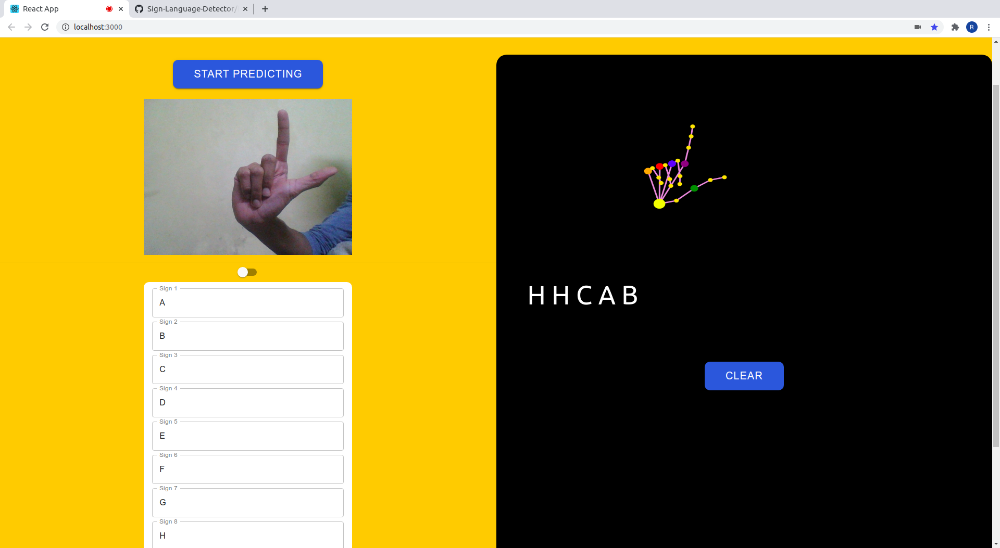
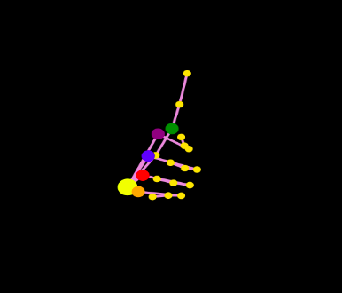
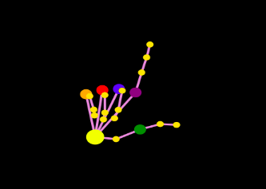
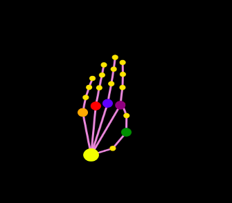
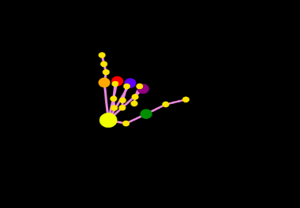
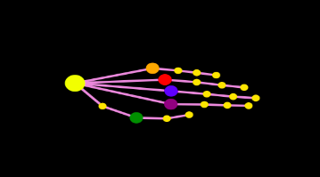
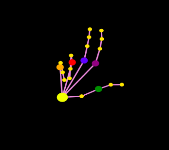
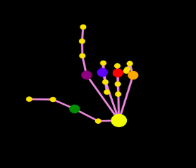
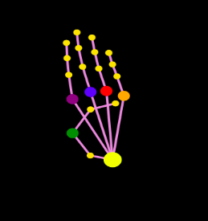
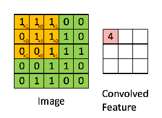

# Multi Purpose Sign Language Detector
We have used eight alignments of the hand to map to any functionality. Currently we have the option of mapping to specific labels or map to some link. This is essentially enforcing a new way of user navigation using handsigns. We have only used eight alignments and not covered the whole alphabet so as to get more accurate results with the training data available to us. With eight signs there is very less probability of vectors of two hand signs to be similar. 

There can be many usecases and automation chances for such a application for example 
1. Mapping the signs to some home functionality like turning the light one, turning fan off etc. 
2. Making a map to most used applications or links and navigate to them using the hand alignments.
3. Playing simple multiplayer games. 
4. Making a page navigation usign the hand alignments. 
5. Creating weird music 
and many more.

## Working

The application implements two of the following above possiblities:
1. Map the hand alignments to labels and make a sentence
2. Map the hand alignments to links and open the link on the browser on detection.

The signs used are given as follows:

1. 
2. 
3. 
4. 
5. 
6. 
7. 
8. 

## Concepts
The concepts used here were the basics of image/video processing as well as deep learning and CNN's to classify the image dataset.
1. Image representation
A particular image is represented as a 3-D array with h*w*d dimensions. In a RGB image d is 3 which means there are 3 channels red,green & blue. Each channel has a 2-D 
representation which means what amount of colour(3rd dimenion) is present at a particular region(denoted by 2-dimension). 

2. Deep learning
Deep learning (also known as deep structured learning) is part of a broader family of machine learning methods based on artificial neural networks(ANN's) with representation     learning. An ANN is based on a collection of connected units or nodes called artificial neurons, which loosely model the neurons in a biological brain. Each connection,         like the synapses in a biological brain, can transmit a signal to other neurons. An artificial neuron that receives a signal then processes it and can signal neurons connected to it. The "signal" at a connection is a real number, and the output of each neuron is computed by some non-linear activation function of the sum of its inputs. The connections are called edges. Neurons and edges typically have a weight that adjusts as learning proceeds. The weight increases or decreases the strength of the signal at a connection. Neurons may have a threshold such that a signal is sent only if the aggregate signal crosses that threshold. Typically, neurons are aggregated into layers. Different layers may perform different transformations on their inputs. Signals travel from the first layer (the input layer), to the last layer (the output layer), possibly after traversing the layers multiple times. 

So basically the image undergoes various transformations in each layer and finally a vector is produced which will help in classifying the objects.
At each layer all the neurons are multiplied with the weight matrix and the non-linear activation function here is 'Leaky-Relu'.

3. Convolution layer
Convolution is the first layer to extract features from an input image. Convolution preserves the relationship between pixels by learning image features using small squares of input data. It is a mathematical operation that takes two inputs such as image matrix and a filter or kernel.

Consider a 5 x 5 whose image pixel values are 0, 1 and filter matrix 3 x 3 as shown in below

Then the convolution of 5 x 5 image matrix multiplies with 3 x 3 filter matrix which is called “Feature Map” as output shown in below

Convolution of an image with different filters can perform operations such as edge detection, blur and sharpen by applying filters. The below example shows various convolution image after applying different types of filters (Kernels).

## Training

## Available Scripts

In the project directory, you can run:

### `yarn start`

Runs the app in the development mode. 
Open [http://localhost:3000](http://localhost:3000) to view it in the browser.

The page will reload if you make edits. 
You will also see any lint errors in the console.

### `yarn test`

Launches the test runner in the interactive watch mode. 
See the section about [running tests](https://facebook.github.io/create-react-app/docs/running-tests) for more information.

### `yarn build`

Builds the app for production to the `build` folder. 
It correctly bundles React in production mode and optimizes the build for the best performance.

The build is minified and the filenames include the hashes. 
Your app is ready to be deployed!

See the section about [deployment](https://facebook.github.io/create-react-app/docs/deployment) for more information.

### `yarn eject`

**Note: this is a one-way operation. Once you `eject`, you can’t go back!**

If you aren’t satisfied with the build tool and configuration choices, you can `eject` at any time. This command will remove the single build dependency from your project.

Instead, it will copy all the configuration files and the transitive dependencies (webpack, Babel, ESLint, etc) right into your project so you have full control over them. All of the commands except `eject` will still work, but they will point to the copied scripts so you can tweak them. At this point you’re on your own.

You don’t have to ever use `eject`. The curated feature set is suitable for small and middle deployments, and you shouldn’t feel obligated to use this feature. However we understand that this tool wouldn’t be useful if you couldn’t customize it when you are ready for it.
